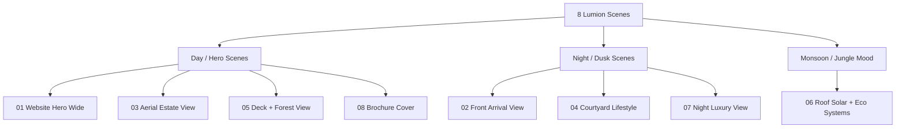

# Lumion Render & Scene Setup Guide — Reserva Varde Goa
**Document Ref:** RVG-2BHK-LRSG-1.0  
**Status:** Completed & Optimized for Lumion 12+  
**Target:** 8 Institutional-Grade Marketing Scenes  

---

## 1. Cinematic Scene Composition & Lighting Guide

This guide details the exact camera settings, time-of-day environments, and psychological visual goals for the 8 pre-configured camera scenes in the Lumion-ready package.

---

## 2. Recommended Lumion Render Effects

To achieve a photorealistic, world-class resort aesthetic, apply these specific Lumion Effect Stacks to your photo views:

### ☀️ Effect Stack A: Day & Golden Hour (Hero Renders)
* **Real Skies:** Choose **Clear Day** or **Golden Hour** (e.g. *Sunset 2* or *Clear 3*). Set the sun angle at a low $12^\circ$ slope, casting long, soft shadows across the gravel path and timber deck.
* **Hyperlight:** Enable and set to **75%**. This calculates realistic bounce light inside the glazed walkways and under the deep roof overhangs.
* **Skylight:** Set to **High / Ultra**. Enhances the global illumination of the surrounding forest canopy.
* **Shadows:** Enable **Soft Shadows** and **Fine Detail Shadows**. Set omnidirectional shadow scale to high.
* **Reflection:** Place active **Reflection Planes** on the courtyard plunge pool, reflecting channel, and the main C1/C2 glass facade.
* **Color Correction:** 
  * Temperature: **0.15** (slight warmth)
  * Contrast: **0.10**
  * Saturation: **1.05** (vibrant jungle greens)
  * Gamma: **1.00**
* **2-Point Perspective:** **ON** (Critical for architectural verticality; prevents vertical lines from converging).
* **Depth of Field:** **ON**. Select the nearest columns or deck furniture as the focus target, setting a mild background blur (aperture: **F/5.6 - F/8**) to create professional cinematic depth.
* **Exposure:** Balanced at **1.1**.

### 🌙 Effect Stack B: Dusk & Night Luxury Renders
* **Real Skies:** Choose **Dusk** or **Overcast Evening** (e.g. *Dusk 1* or *Night 2*).
* **Interior Lighting:** Place warm **Lumion Spotlights** ($2700\text{K}$ color temperature) inside the container ceilings, directed at the timber slatted TV wall, the dining table, and bedroom beds.
* **Exterior Path & Deck Lights:**
  * Assign high **Emissive Power** ($20.0$) to the garden path light heads (`RV_Emissive_Light`).
  * Place soft, warm spot cones pointing downward from the south verandah pergolas onto the deck boards.
  * Hide a warm area light inside the firepit circle, simulating glowing hot coals.
* **Reflection:** Ensure reflection planes are active to capture the warm window glow reflecting on the plunge pool surface and concrete channels.
* **Bloom:** Set to **15%**. This adds a dreamy, high-end resort glow to the path light heads and glowing window panels without blowing out details.
* **2-Point Perspective:** **ON**.

### 🌧️ Effect Stack C: Monsoon & Jungle Mood Renders
* **Atmosphere:** Choose **Overcast Sky** (e.g. *Overcast 1* or *Stormy 2*). Set sun intensity to low ($0.1$).
* **Rain Effect (Lumion 12+):** 
  * Precipitation: **Medium / Rain**
  * Wetness slider: **0.80** (creates reflective slick surfaces on paths, stone walls, and teak decks)
  * Puddle size: **0.30** (subtle puddles in gravel driveway depressions)
  * Splash scale: **Low** (soft rain splatter)
* **Mist / Fog:** Add a very thin layer of ground fog/mist in the background forest buffer to emphasize the deep Goan jungle humidity.
* **Color Correction:** Set temperature to **-0.10** (cooler, monsoonal slate tones) while keeping contrast high.

---

## 3. High-Value Scene Guide

### Scene 1: Website Hero Wide View
* **Camera Setup:** Cinematic diagonal shot from the southeast, villa centered, forest depth stretching behind.
* **Atmosphere:** Low, warm golden hour sunlight.
* **Visual Goal:** High-impact website homepage banner showing the ultimate union of industrial luxury and wild Goan nature.

### Scene 2: Front Arrival View
* **Camera Setup:** Eye-level camera from the entry path looking past the natural laterite piers, welcome sign, and sliding timber gate.
* **Atmosphere:** Dusk twilight with path lights glowing warmly.
* **Visual Goal:** Evoke the emotional experience of arriving at a private, secure, elite forest sanctuary.

### Scene 3: Aerial Estate View
* **Camera Setup:** High-altitude drone angle looking down at the courtyard, deck, roof, solar mounts, and surrounding 1-acre forest.
* **Atmosphere:** Crisp, bright clear day.
* **Visual Goal:** Perfect layout orientation for the master investor deck.

### Scene 4: Courtyard Lifestyle View
* **Camera Setup:** Human-level perspective standing in the courtyard looking past the concrete plunge pool towards the cushion-topped laterite bench and reflecting channel.
* **Atmosphere:** Soft late-afternoon sun with glowing warm interior window lights.
* **Visual Goal:** Sell the tranquil, resort-grade, private courtyard lifestyle.

### Scene 5: Deck + Forest View
* **Camera Setup:** Low-angle shot from the edge of the forest deck looking out towards the surrounding areca palms and bamboo.
* **Atmosphere:** Golden hour sun filtering through the tree canopy, casting linear shadows across the sun loungers.
* **Visual Goal:** Emphasize the "living inside a private jungle canopy" experience.

### Scene 6: Roof Solar + Eco Systems View
* **Camera Setup:** Elevated perspective focusing on the West Wing roofs. Displays the 6 solar panels, the clean gutter lines, and the timber-screened STP/cistern utility zone.
* **Atmosphere:** Soft, diffused monsoonal overcast light.
* **Visual Goal:** Highlight engineering, self-sufficiency, and monsoon-readiness.

### Scene 7: Night Luxury View
* **Camera Setup:** Low-angle perspective looking across the reflecting pool towards the bedroom glass wings.
* **Atmosphere:** Midnight dark sky. Warm spot lighting and emissive path lights are active, reflecting on the pool.
* **Visual Goal:** Widescreen luxury catalog image highlighting ambient evening coziness.

### Scene 8: Brochure Cover View
* **Camera Setup:** Symmetrical, centered architectural elevation looking past the curved path.
* **Atmosphere:** Dramatic golden hour sunset sky.
* **Visual Goal:** Elite cover visual for the physical pre-sales brochure.

---

## 4. Lumion Landscape & Foliage Direction

To ensure the master project feels incredibly premium, replace the placeholder SketchUp geometry with high-fidelity Lumion 3D assets:

1. **Jungle Canopy Background:**
   * Replace `RV_Landscape_Shrubs` tree shapes in the background with a dense mix of Lumion's **Areca Palms**, **Coconut Palms**, and **Broadleaf Jungle Trees (e.g. Indian Laurel or Teak trees)**.
   * Group trees closely together along the north, east, and west boundaries to create a thick, unbroken jungle wall.
2. **Courtyard Plumeria Accent:**
   * Place a beautiful, twisting **Plumeria (Frangipani) Tree** in the courtyard planter.
   * Scatter delicate white and yellow petals floating on the surface of the reflecting water channel (`RV_Water_PlungePool`) to add micro-lifestyle details!
3. **Understory Planting:**
   * Scatter dense clusters of **Sword Ferns**, **Elephant Ears (Alocasia)**, and wild **Canna Lilies** along the edges of the red laterite plinths and retaining walls.
   * This screens the sharp concrete-to-soil joints, making the architecture look naturally overgrown by the forest.
4. **Pebble Swale detailing:**
   * Replace `RV_Pebble_Swale` with a mix of Lumion's 3D pebbles, small river rocks, and weathered boulders.
   * Add a few **Water Lilies** or moisture-loving grass tufts inside the swale depressions.
