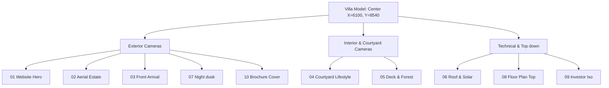

# Professional Render & Scene Setup Guide — Reserva Varde Goa 2BHK
**Document Ref:** RVG-2BHK-FRG-3.0  
**Status:** Completed & Successfully Verified in SketchUp 2023  
**Target:** 10 Presentation Renders for Brochures & Web  

---

## 1. Render & Camera Composition
This guide outlines the camera composition, lighting setups, and specific purposes of the 10 high-resolution presentation scenes configured in `reserve_varde_2bhk_upgraded_generator.rb`. All scenes are exported at Full HD ($1920 \times 1080$ pixels) with anti-aliasing.

---

## 2. Comprehensive Scene Parameters Table

| Scene Name | Eye Vector (X, Y, Z mm) | Target Vector (X, Y, Z mm) | Projection | Shadow State | File Name |
| :--- | :--- | :--- | :--- | :--- | :--- |
| **01 Website Hero Wide View** | `[48000, -25000, 18000]` | `[6100, 8540, 1200]` | Perspective | OFF | `reserva_varde_2bhk_website_hero.png` |
| **02 Luxury Aerial Estate View** | `[35000, -18000, 20000]` | `[6100, 8540, 1500]` | Perspective | OFF | `reserva_varde_2bhk_aerial_estate.png` |
| **03 Front Arrival View** | `[6100, -12000, 2000]` | `[6100, 2000, 1800]` | Perspective | OFF | `reserva_varde_2bhk_front_arrival.png` |
| **04 Courtyard Lifestyle View** | `[6100, 5000, 1600]` | `[6100, 12000, 2200]` | Perspective | OFF | `reserva_varde_2bhk_courtyard_lifestyle.png` |
| **05 Deck + Forest View** | `[6100, -9000, 1500]` | `[6100, 2000, 2200]` | Perspective | OFF | `reserva_varde_2bhk_deck_forest.png` |
| **06 Roof Solar + Monsoon Systems** | `[-10000, 22000, 15000]` | `[6100, 8540, 3000]` | Perspective | OFF | `reserva_varde_2bhk_roof_solar.png` |
| **07 Night Warm Lighting View** | `[22000, -10000, 6000]` | `[6100, 8540, 1500]` | Perspective | **ON (19:00 IST)**| `reserva_varde_2bhk_night_lighting.png` |
| **08 Floor Plan Top View** | `[6100, 8540, 45000]` | `[6100, 8540, 0]` | Parallel (24m)| OFF | `reserva_varde_2bhk_floor_plan_top.png` |
| **09 Investor Presentation Iso** | `[-22000, -22000, 25000]` | `[6100, 8540, 1000]` | Perspective | OFF | `reserva_varde_2bhk_investor_isometric.png` |
| **10 Brochure Cover View** | `[6100, -14000, 3000]` | `[6100, 1000, 1500]` | Perspective | OFF | `reserva_varde_2bhk_brochure_cover.png` |

---

## 3. Composition Details & Visual Strategy

### 01 Website Hero Wide View
* **Composition:** Placed from the south-east corner looking diagonally across the site. Captures the full frontage of the villa, the forest deck, the winding paths, the pool reflecting channel, and the background forest.
* **Visual Goal:** High-impact banner image displaying natural harmony, luxury decking, and organic architecture.

### 02 Luxury Aerial Estate View
* **Composition:** Elevated drone-angle perspective looking down on the central courtyard. Shows how the 7 containers frame the courtyard pool and how the double-glazed corridors link the private and public wings.
* **Visual Goal:** Clarify the layout form, spatial flow, and modular architecture.

### 03 Front Arrival View
* **Composition:** Human eye-level view from the gravel parking lot, looking past the organic welcome path and laterite piers.
* **Visual Goal:** Recreate the emotional arrival experience, emphasizing local laterite masonry and elegant warm teak slats.

### 04 Courtyard Lifestyle View
* **Composition:** Standing inside the courtyard looking north. Frame captures the turquoise plunge pool, the concrete reflecting channel, the laterite bench with sand cushions, and the Plumeria garden planter.
* **Visual Goal:** Promote "tranquil, high-end, tropical courtyard living".

### 05 Deck + Forest View
* **Composition:** Low-angle shot from the edge of the forest deck looking back up towards the south verandah pergola. Captures the teak loungers, the bronze-post glass railing, and the sliding doors.
* **Visual Goal:** Emphasize indoor-outdoor integration and the monsoonal safety raised base.

### 06 Roof Solar + Monsoon Systems View
* **Composition:** High-angle rear view looking southwest, emphasizing the flat roofs. Displays the 6 sloped solar panels, the wind-safe framing, the continuous gutters, and the bio-digester/cistern service court.
* **Visual Goal:** Highlight low-carbon green technology and monsoon engineering.

### 07 Night Warm Lighting View
* **Composition:** Low-angle dusk perspective looking across the driveway. Shadow offsets are turned ON, and the timezone is offset to +5.5 (IST) at 19:30, casting rich golden, ambient evening rays.
* **Visual Goal:** Display the bronze path light pillars and warm window glow, projecting a cozy luxury resort aura.

### 08 Floor Plan Top View
* **Composition:** Exact 2D orthographic projection from Z = 45m looking straight down on the Z=0 plane. Uses a camera height of 24 meters to fit the entire villa.
* **Visual Goal:** Clean, technical floor plan layout presentation showing container integration.

### 09 Investor Presentation Isometric View
* **Composition:** Axonometric-style high perspective from the southwest corner looking across the estate.
* **Visual Goal:** A sophisticated, formal drawing showing scale, terrain boundaries, and site planning.

### 10 Brochure Cover View
* **Composition:** Elevated center-aligned perspective looking directly down the central axis of the front yard.
* **Visual Goal:** Perfectly symmetrical, striking architectural cover shot.
