# Website & Catalog Image Placement Guide — Reserva Varde Goa
**Document Ref:** RVG-2BHK-WIPG-3.0  
**Status:** Completed & Ready for Front-End Developers  
**Applicable Platform:** Reserva Varde Goa Luxury Portal  

---

## 1. Landing Page Integration Map

This guide lists where and how to integrate the 10 exported SketchUp images on the **Reserva Varde Goa** website to maximize engagement and investor conversions.

```mermaid
graph TD
    A[reserva_varde_2bhk_website_hero.png] --> HeroPanel[1. HERO BLOCK: Full Width Screen Background]
    B[reserva_varde_2bhk_aerial_estate.png] --> LayoutSect[2. CONFIGURATOR: Interactive Container Layout]
    C[reserva_varde_2bhk_front_arrival.png] --> ExperienceSect[3. ARRIVAL: The Forest Sanctuary Experience]
    D[reserva_varde_2bhk_courtyard_lifestyle.png] --> CourtyardSect[4. LIFESTYLE: Central Courtyard Living]
    E[reserva_varde_2bhk_deck_forest.png] --> DeckSect[5. DECK: Premium Teak Forest Decks]
    F[reserva_varde_2bhk_roof_solar.png] --> TechSect[6. TECH: Zero Carbon off-grid solar systems]
    G[reserva_varde_2bhk_night_lighting.png] --> LightSect[7. ATMOSPHERE: Dusk Resort Lighting]
    H[reserva_varde_2bhk_floor_plan_top.png] --> BlueprintSect[8. LAYOUT: Modular Floor Plan Specifications]
    I[reserva_varde_2bhk_investor_isometric.png] --> InvestSect[9. INVESTMENT: 1-Acre Estate Plan Metrics]
    J[reserva_varde_2bhk_brochure_cover.png] --> DownloadSect[10. BROCHURE: Investor Kit PDF Cover]
```

---

## 2. Comprehensive Placement & Layout Specs

### 1. HERO BLOCK: Full-Screen Background Banner
* **Image File:** `reserva_varde_2bhk_website_hero.png`
* **Placement:** Primary viewport block above the fold (`<section id="hero">`).
* **Design Implementation:**
  * Render as a full-bleed background using CSS: `background-size: cover; background-position: center;`.
  * Superimpose a dark frosted glass mask (glassmorphism overlay) on the left side: `backdrop-filter: blur(10px); background: rgba(15, 23, 42, 0.45);`.
  * Layer the primary hero headline in high-contrast white Outfit font: *"Where Industrial Sophistication Meets Wild Tropical Forest."*

### 2. ARCHITECTURAL LAYOUT: Interactive Tab Section
* **Image File:** `reserva_varde_2bhk_aerial_estate.png`
* **Placement:** Tab "02 Architecture & Flow" inside the configurator module.
* **Design Implementation:**
  * Place in a two-column grid. Left side shows the image with an expandable modal button. Right side outlines the 7-container geometry, double-glazed connector corridor, and private vs. public wings.
  * Add hotspots on the image linking to detailed specifications of each wing.

### 3. THE ARRIVAL SEQUENCE: Organic Approach Block
* **Image File:** `reserva_varde_2bhk_front_arrival.png`
* **Placement:** Scroll-triggered experiential section: *"The Arrival Sanctuary"*.
* **Design Implementation:**
  * Integrate inside an overlapping cards layout. The image sits on the left with a subtle slide-in animation.
  * Text overlays explain the Laterite masonry entry piers, sliding solid teak gates, and the organic curved stepping pathway winding through native bamboo.

### 4. TRANQUIL COURTYARD OASIS: Core Lifestyle Showcase
* **Image File:** `reserva_varde_2bhk_courtyard_lifestyle.png`
* **Placement:** Central features column under *"Tranquility & Water"*.
* **Design Implementation:**
  * Present in a wide, elegant canvas container.
  * Overlay micro-indicators showing the plunge pool depth ($1.2\text{ m}$), the symmetrical concrete reflecting channel, the laterite built-in seating, and the Plumeria garden planter.

### 5. DECK & FOREST OUTDOOR: Indoor-Outdoor Transition
* **Image File:** `reserva_varde_2bhk_deck_forest.png`
* **Placement:** Sub-panel under *"The Outdoor Teak Deck Experience"*.
* **Design Implementation:**
  * Split grid showing this rendering on the right, and a technical drawing of the foundation piling on the left.
  * Captions highlight the raised plinth structure, the bronze-post minimal glass railings, and the dual sun loungers.

### 6. ECO-SYSTEMS & MONSOON: Off-Grid Engineering
* **Image File:** `reserva_varde_2bhk_roof_solar.png`
* **Placement:** High-visibility panel under *"Sustainable Engineering & Zero Carbon"*.
* **Design Implementation:**
  * Interactive schematic grid. Overlapping badges display technical copy:
    * **Solar Array:** *"6 Monocrystalline PV panels (3.3 kWp) sloped at 1.2 degrees for rapid monsoonal drainage."*
    * **Water System:** *"STP bio-digester and rainwater cistern hidden behind timber privacy screens."*

### 7. DUSK ATMOSPHERE GALLERY: Romantic Lighting Highlight
* **Image File:** `reserva_varde_2bhk_night_lighting.png`
* **Placement:** Evening/Aura gallery carousel.
* **Design Implementation:**
  * Place as the opening slide in a full-screen ambient image carousel.
  * Add a toggle button labeled: *"Switch to Dusk Lighting"* which transitions the site theme to dark mode when clicked.

### 8. BLUEPRINT SPECIFICATIONS: Technical Floor Plan
* **Image File:** `reserva_varde_2bhk_floor_plan_top.png`
* **Placement:** Section *"Modular Specifications & Floor Plans"*.
* **Design Implementation:**
  * Clean, high-contrast, scalable white container.
  * Overlay an interactive measurement grid mapping the exact $160\text{ m}^2$ internal area, the $72\text{ m}^2$ central courtyard, and the $84\text{ m}^2$ teak deck.

### 9. INVESTMENT CASE STUDY: 1-Acre Estate Plan
* **Image File:** `reserva_varde_2bhk_investor_isometric.png`
* **Placement:** Investor portal dashboard under *"Land & Site Metrics"*.
* **Design Implementation:**
  * Pair with land allocation metrics (gravel driveway parking, firepit meditation circle, bioswale gardens).
  * Showcases the structural boundaries of the 1-acre estate.

### 10. DOWNLOAD CATALOGUE: Direct Conversion Call-to-Action
* **Image File:** `reserva_varde_2bhk_brochure_cover.png`
* **Placement:** Sidebar conversion widget and bottom footer call-to-action.
* **Design Implementation:**
  * Style as a highly realistic 3D hard-cover brochure mock-up angled on a wooden background.
  * Placing a prominent golden button over it: *"Download Complete 2BHK Investor Kit (PDF)"*.
